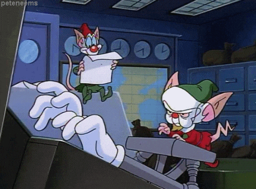

<div align="center">

<h1>Hi, I'm Pauline</h1>




<sub><i>trying to take over the world, one clean commit at a time</i></sub>

</div>


## whoami

```console
$ git log --oneline --reverse --decorate pauline/
b0a71e0  10+ years cutting film: clips, documentaries, news
c1d2e3f  2025: switched careers, joined 42 Paris, learned how computers actually work
a4d5e6f  2026: finished 42 Paris common core
f9e8d7c  (HEAD -> main) product-minded full-stack dev in the making
$ cat ~/.whoami
tinkerer-in-chief, reads man pages for fun
$ cat << 'EOF'
editing is deciding what matters in a pile of raw footage and
cutting the rest. coding turned out to be the same call on
different material, so more of it transferred than I expected.
EOF
```

Client briefs in editing are never clear either: "make it punchier" is basically the "it should feel more modern" of code reviews. You learn fast to become a bit of a wizard mind reader, guessing what people actually want when they can't quite say it themselves, because half the time they don't know until you show them the wrong version first. And "finished" was always a lie in editing too, there's always one more cut you could make. Shipping software has the exact same problem, just with more Slack messages about it. But honestly, I love that part. Figuring out what someone actually needs, even when they can't put it into words, is the best puzzle there is.

I just wrapped up 42 Paris's common core, so now I'm in the choose-your-path phase: internship first, then a specialization. Right now I'm deep in TypeScript (Nest and React), gearing up for my full-stack internship, which I'm honestly just excited to start so I can go fight real problems instead of tutorial ones. On the side I'm building a legal torrent-fetching tool for users, mostly as an excuse to poke around and figure out which specialization at 42 I want to chase next. It's messy, it's fun, it's exactly how I like to learn. Lately that same curiosity keeps pulling me toward the dark side (aka devops): CI, containers, the stuff that runs the stuff.

And yeah, I've fallen down the agentic/automation rabbit hole, mostly to make my workflow less painful with the help of my colleague Claude.

<table align="center"><tr><td align="center">

[](mailto:kidp8479@gmail.com)

to say it the LinkedIn way: add me to your team for more atomic commits, fewer mystery-novel changelogs, and questions asked before the first line of code

underneath all of it I'm just an enthusiast, always eager to learn, a product-minded dev at heart

</td></tr></table>

## how to be my best buddy

I get genuinely excited about a well-organized, scalable, clean system, the kind where you open the repo six months later and it still makes sense without a Slack archaeology session. Here's what gets me:

<table>
<tr><td><b>good practices</b></td><td>

atomic commits that do one thing, conventional commit prefixes so the changelog isn't a mystery novel, PRs small enough to actually review properly instead of skimming and approving out of guilt. Code reviews where the comment explains why and offers a way out, not just "change this", because somebody took the time to write that code and deserves an actual conversation about it, not a drive-by correction

</td></tr>
<tr><td><b>tools</b></td><td>

I love tools. Testing them, configuring them, tweaking every setting until it fits exactly how I work. I tried Neovim once and now we're in a toxic relationship, time stops existing, I look up and it's 2am and I've configured seventeen keybindings I'll never remember. Also I'm a menace when it comes to GitHub branch protection rules, required reviewers, status checks, linear history, no force push to main, I've read every option in that settings page for fun. And I get weirdly happy setting up a linter and formatter combo following something like antfu's eslint config, instead of just keeping whatever the framework shipped with by default

</td></tr>
<tr><td><b>workflows worth hardening</b></td><td>

a CI pipeline that catches a broken build before it ever reaches a teammate, pre-commit hooks that save me from my own 6pm typos, a branching strategy the whole team actually agreed on in a five minute conversation instead of one person just deciding it and everyone quietly resenting it

</td></tr>
<tr><td><b>docs that actually help</b></td><td>

a README with a real quickstart that gets someone running in under five minutes, comments that explain the weird decision instead of restating the code line by line, commit messages I can read in six months and still understand what past-me was thinking, and honestly still be a little proud of

</td></tr>
<tr><td><b>clear communication</b></td><td>

same instinct as editing, say the thing in one message instead of three, flag a blocker before it becomes a fire drill, ask the dumb question early instead of guessing wrong for two days and making everyone's Friday worse

</td></tr>
</table>

## the vocabulary

if I were an ATS, here's the keyword list that'd make anyone auto-pass my filter:

- **commits & flow** · atomic commits, conventional commits, git flow, one issue = one branch = one PR, clean merge/rebase/reconciliation strategy
- **before merge** · re-read the diff, green CI, pre-commit hooks, secret scanning, a test per new behavior, web-security-review
- **decisions & docs** · ADR, comment the why, document the public surface
- **planning & collab** · kanban, Linear, Notion, Miro, Figma, Excalidraw, Slack, Discord (hand me any of them and watch me light up)
- **wiring things together** · MCP, so Claude can go check the ticket, read the diff or open the PR instead of me copy-pasting context around
- **still leveling up** · TDD, definition of ready & done, user journey, NFR, observability, code owners, rollback plan, feature flags, postmortems

## reach me

[](mailto:kidp8479@gmail.com)
[](https://www.linkedin.com/in/pauline-f8479/)

<sub>you can also always ask me about: switching from video editing to code at 42 &nbsp;·&nbsp; getting started in tech as a beginner &nbsp;·&nbsp; configuring stuff at 2 a.m for fun (please send help)</sub>
